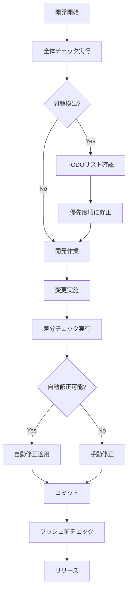

# Smart Review システム運用ガイドライン

## 目次
1. [システム概要](#システム概要)
2. [初期セットアップ](#初期セットアップ)
3. [日常運用](#日常運用)
4. [ベストプラクティス](#ベストプラクティス)
5. [トラブルシューティング](#トラブルシューティング)
6. [パフォーマンスチューニング](#パフォーマンスチューニング)

## システム概要

Smart Review システムは、Claude Codeと複数のAIエージェントを活用した統合的なコードレビューシステムです。

### 主要機能
- **セキュリティ脆弱性検出**: XSS、SQLインジェクション、CSRF等の検出
- **バグ検出と自動修正**: ロジックエラー、メモリリーク、パフォーマンス問題
- **コード品質評価**: アーキテクチャ、デザインパターン、コードスメル
- **ドキュメント管理**: ドキュメントの不足と不整合の検出
- **日本語コメント注釈**: コードへの自動コメント追加

### バージョン情報
- **現在のバージョン**: 2.0.1 (セキュリティ強化版)
- **最新アップデート**: 
  - 対話式メニュー、システムテスト機能追加
  - 設定管理モジュール (`smart-review-config.js`) による一元化
  - Windows管理者権限チェック機能
  - エラーハンドリングの強化
- **必要要件**:
  - Node.js 14以上
  - Claude Code CLI
  - Git (オプション、差分検出用)

## 初期セットアップ

### 1. グローバル設定

```bash
# グローバルコマンドディレクトリの作成
mkdir -p ~/.claude/commands

# コマンドファイルのコピー
cp smart-review-v2.js ~/.claude/commands/
cp smart-review-config.js ~/.claude/commands/

# 実行権限の付与（Unix系OS）
chmod +x ~/.claude/commands/*.js

# Windows の場合（PowerShell）
copy smart-review-v2.js %USERPROFILE%\.claude\commands\
copy smart-review-config.js %USERPROFILE%\.claude\commands\
```

### 2. プロジェクト初期化

```bash
# プロジェクトディレクトリで実行
npx init-smart-review

# または手動で
node ~/.claude/commands/init-smart-review.js
```

### 3. 設定のカスタマイズ

`.smart-review.json`を編集してプロジェクト固有の設定を行います：

```json
{
  "agents": [
    {
      "id": "security-error-xss-analyzer",
      "enabled": true,
      "priority": "critical",
      "timeout": 120000
    }
  ],
  "performance": {
    "maxConcurrency": 4,
    "cacheEnabled": true
  }
}
```

## 日常運用

### 基本的な使用フロー

#### 0. 初回セットアップ（システムテスト）
```bash
# 環境の動作確認
claude-code smart-review --test

# 問題がなければ次へ進む
```

#### 1. 開発開始時（対話式メニュー使用）
```bash
# 対話式メニューで選択
claude-code smart-review

# または直接実行
claude-code smart-review --scope all
```

#### 2. コミット前（差分チェック）
```bash
# 変更差分の自動修正
npm run review:fix

# または
claude-code smart-review --scope changes
```

#### 3. リリース前（セキュリティチェック）
```bash
# セキュリティ問題のみチェック
npm run review:security

# または
claude-code smart-review --scope all --priority-threshold critical
```

### 推奨ワークフロー



## ベストプラクティス

### 1. 優先度管理

**優先度レベルと対応指針**:

| 優先度 | 記号 | 対応タイミング | 例 |
|--------|------|----------------|-----|
| Critical | 🔴 | 即座に対応 | セキュリティ脆弱性、データ漏洩リスク |
| High | 🟠 | 当日中に対応 | クラッシュバグ、ロジックエラー |
| Medium | 🟡 | 週内に対応 | コード品質、パフォーマンス |
| Low | 🟢 | 時間があれば | ドキュメント、コメント |

### 2. キャッシュ活用

```bash
# キャッシュを有効にして高速化
export SMART_REVIEW_CACHE=true

# キャッシュのクリア
rm -rf .smart-review-cache/
```

### 3. 並列実行の最適化

```javascript
// .smart-review.json での設定
{
  "performance": {
    "maxConcurrency": 4,  // CPUコア数に応じて調整
    "batchSize": 10       // ファイル数に応じて調整
  }
}
```

### 4. CI/CDへの統合

#### GitHub Actions例

```yaml
name: Smart Review

on:
  pull_request:
    types: [opened, synchronize]

jobs:
  review:
    runs-on: ubuntu-latest
    steps:
      - uses: actions/checkout@v2
      
      - name: Setup Node.js
        uses: actions/setup-node@v2
        with:
          node-version: '16'
      
      - name: Install Claude Code
        run: |
          # Claude Code CLIのインストール
          npm install -g @anthropic/claude-code
      
      - name: Run Smart Review
        run: |
          npx init-smart-review
          npm run review:security
      
      - name: Upload Results
        uses: actions/upload-artifact@v2
        with:
          name: smart-review-results
          path: smart-review-results/
```

### 5. チーム運用

#### コードレビュープロセス

1. **自動レビュー優先**: PRを作成する前にSmart Reviewを実行
2. **結果の共有**: TODOリストとレポートをチームで共有
3. **段階的修正**: 優先度に基づいて段階的に修正
4. **定期実行**: 週次でプロジェクト全体チェックを実行

#### 設定の標準化

```bash
# チーム共通設定のテンプレート化
cp team-standard.smart-review.json .smart-review.json

# 環境変数での制御
export SMART_REVIEW_DISABLED_AGENTS="documentation-updater"
export SMART_REVIEW_MAX_CONCURRENCY=2
```

## トラブルシューティング

### システムテストの活用

新しいプロジェクトや環境で問題が発生した場合、まずシステムテストを実行：

```bash
claude-code smart-review --test
```

このコマンドは以下をチェックします：
- Node.jsバージョン
- Gitリポジトリ状態
- ファイルシステム権限
- Claude CLI availability
- エージェントの存在
- セキュリティモジュール動作
- キャッシュシステム

### よくある問題と解決方法

#### 1. タイムアウトエラー

**症状**: エージェント実行がタイムアウトする

**解決方法**:
```javascript
// .smart-review.json
{
  "agents": [
    {
      "id": "deep-code-reviewer",
      "timeout": 300000  // 5分に延長
    }
  ]
}
```

#### 2. メモリ不足

**症状**: "JavaScript heap out of memory"エラー

**解決方法**:
```bash
# Node.jsのメモリ制限を増やす
export NODE_OPTIONS="--max-old-space-size=4096"
npm run review
```

#### 3. キャッシュの不整合

**症状**: 古い結果が表示される

**解決方法**:
```bash
# キャッシュクリア
rm -rf .smart-review-cache/
npm run review
```

#### 4. パス関連エラー

**症状**: "不正なパス"エラー

**解決方法**:
```javascript
// .smart-review.json
{
  "security": {
    "allowedPaths": ["./src", "./lib"],
    "blockedPatterns": ["node_modules", ".git"]
  }
}
```

### デバッグモード

```bash
# 詳細ログの有効化
export SMART_REVIEW_DEBUG=true
export SMART_REVIEW_LOG_LEVEL=debug

# 実行
npm run review
```

## パフォーマンスチューニング

### 1. 大規模プロジェクト向け設定

```javascript
// .smart-review.json
{
  "performance": {
    "maxConcurrency": 2,      // 並列度を下げる
    "batchSize": 5,           // バッチサイズを小さく
    "cacheEnabled": true,     // キャッシュ必須
    "cacheTTL": 3600000      // キャッシュ期間を延長
  },
  "security": {
    "maxFileSize": 5242880,   // 5MBに制限
    "blockedPatterns": [
      "node_modules",
      "dist",
      "build",
      "*.min.js",
      "*.bundle.js"
    ]
  }
}
```

### 2. 高速実行モード

```bash
# セキュリティとバグのみチェック（高速）
claude-code smart-review --scope all \
  --disable-agents "documentation-updater,deep-code-reviewer"

# キャッシュを活用した差分チェック
claude-code smart-review --scope changes --use-cache
```

### 3. メトリクス監視

```javascript
// カスタムメトリクス収集
const metrics = {
  startTime: Date.now(),
  filesProcessed: 0,
  issuesFound: 0,
  cacheHits: 0,
  cacheMisses: 0
};

// 実行後のメトリクス確認
console.log('Performance Metrics:', {
  totalTime: Date.now() - metrics.startTime,
  averageTimePerFile: (Date.now() - metrics.startTime) / metrics.filesProcessed,
  cacheHitRate: metrics.cacheHits / (metrics.cacheHits + metrics.cacheMisses)
});
```

## 付録

### A. 環境変数一覧

| 環境変数 | 説明 | デフォルト値 |
|----------|------|-------------|
| `SMART_REVIEW_CONFIG` | 設定ファイルパス | `.smart-review.json` |
| `SMART_REVIEW_CACHE` | キャッシュ有効/無効 | `true` |
| `SMART_REVIEW_MAX_CONCURRENCY` | 最大並列実行数 | `4` |
| `SMART_REVIEW_DEBUG` | デバッグモード | `false` |
| `SMART_REVIEW_DISABLED_AGENTS` | 無効化するエージェント | なし |
| `CLAUDE_AGENTS_PATH` | エージェントのパス | `~/.claude/agents` |

### B. 設定ファイルスキーマ

```typescript
interface SmartReviewConfig {
  project?: {
    name: string;
    path: string;
    created: string;
    version: string;
  };
  agents: Array<{
    id: string;
    name?: string;
    enabled: boolean;
    priority: 'critical' | 'high' | 'medium' | 'low';
    timeout?: number;
    model?: string;
  }>;
  performance?: {
    maxConcurrency: number;
    cacheEnabled: boolean;
    cacheTTL: number;
    maxCacheSize: number;
    batchSize: number;
  };
  security?: {
    allowedPaths: string[];
    blockedPatterns: string[];
    maxFileSize: number;
    sanitizeOutput: boolean;
    preventPathTraversal: boolean;
  };
  output?: {
    format: 'markdown' | 'html' | 'both';
    includeMetrics: boolean;
    includeRawOutput: boolean;
    timestampFormat: string;
  };
}
```

### C. カスタムエージェントの追加

```javascript
// カスタムエージェントの定義
const customAgent = {
  id: 'custom-linter',
  name: 'カスタムリンター',
  model: 'sonnet',
  path: '~/.claude/agents/custom-linter',
  role: 'プロジェクト固有のルールチェック',
  category: 'custom',
  errorTypes: ['naming-convention', 'project-specific'],
  canAutoFix: false,
  priority: 'medium'
};

// .smart-review.json に追加
{
  "agents": [
    // ... 既存のエージェント
    {
      "id": "custom-linter",
      "enabled": true,
      "priority": "medium"
    }
  ]
}
```

## サポート

問題が解決しない場合は、以下の情報を含めてサポートに連絡してください：

1. エラーメッセージの完全なログ
2. `.smart-review.json`の内容
3. 実行したコマンド
4. Node.jsとClaude Codeのバージョン
5. オペレーティングシステム情報

---

*最終更新: 2025年8月14日*
*バージョン: 2.0.1*
*設定管理: smart-review-config.jsモジュール対応*